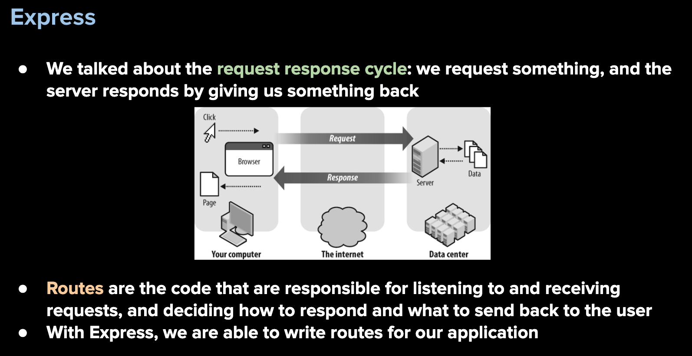
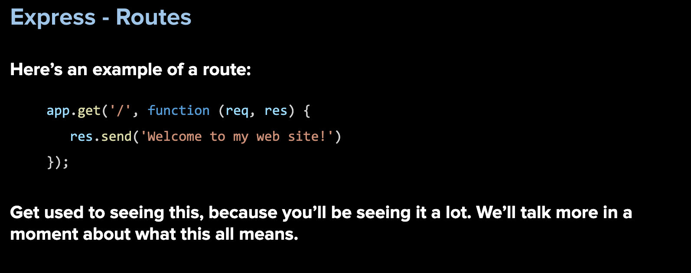
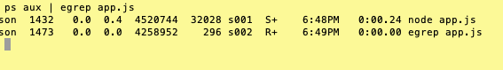
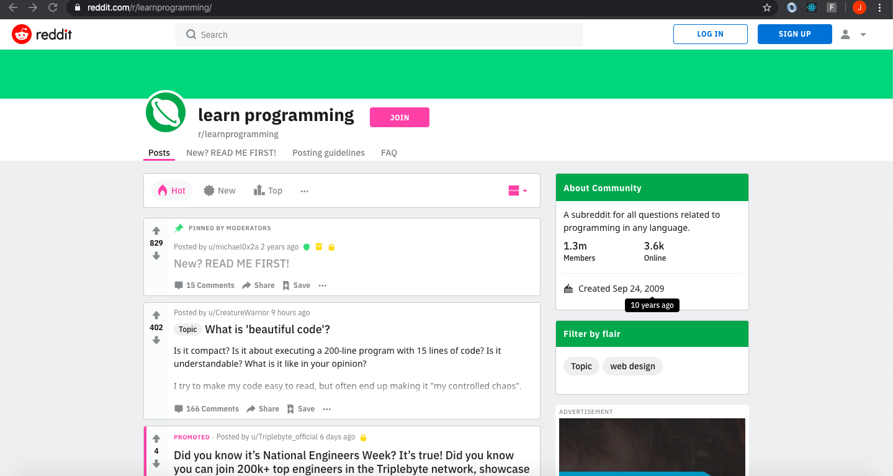
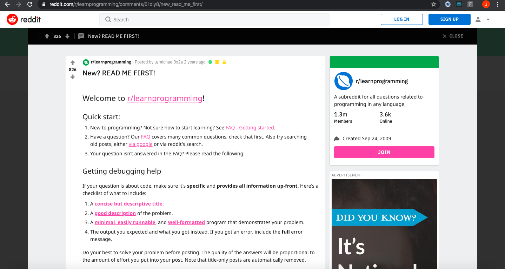

### Express.js

Express is the most popular Node web framework. It is going to be the backbone of our web applications for now as we explore how the "backend" servers work.. It provides functions for pretty much everything you need to do to build a web server.

Express handles things like cookies, parsing the request body, forming the response and handling routes. It is minimalistic, versus some frameworks that give you way too much code to work with.

Why is too much code in a framework sometimes not a good thing? This potentially could be problematic because some beginner developers do not understand what is going on under the hood.

Head over to https://expressjs.com/ for more on Express.

With Express, we are going to build a back-end server that will allow us to handle routes:





<hr>
<br>

When building a server, think of it in three parts: 

    FOUNDATION: this is where you require your modules and set most of your global variables and anything else that will be needed for route handlers

    ROUTE HANDLERS: as the name implies, these are the functions that handle routes

    LISTENER: this is the last part of your code that listens for a particular port and allows your server to handle routes

<hr>
<br>

The ```package.json``` file contains metadata about the application. It contains information such as name, description, version number, author, etc. 

More importantly, it also contains a list of the packages that the application depends on. These are known as “dependencies”.

When we share repositories of projects, they could depend on 10, 20 or even over 100 external modules. 

Rather than uploading all of those modules, we can instead list them in the package.json file and then have other users download it themselves.

Think of this analogy to explain this: The package.json is a recipe and contains a list of ingredients needed to put the app together.

<b><em>NOTE:</em></b> Therefore, every time we create a new application with Node, we want to start including a package.json file.

We can do this manually, but there is a better way through a command called "npm init".

<hr>

## <center><b id='_subReadTask1'>Killing the Node Process</b></center>
<br>

### IMPORTANT: 
When working with backend technologies such as express (or servers in general), it is important to remember a couple concepts during the development phases:

1) Every time you make a change to your index.js (or whatever you have called your server file) you ```MUST``` stop the node process and restart it.

2) You can do this by holding down the control key on your computer and tapping the c key <b>(CTRL + C)</b>. This will stop the node process from running.

3) Restart your node process as you have previously done.

4) If you are trying to run your node process and you get an error similar to  this:

    `Error: listen EADDRINUSE`

This means you have a server currently running on that current port. You need to find where that process is running and stop it.

    a) Go to your terminal and type the following command where app.js represents the file you believe is running (could be index.js or server.js): 

            ps aux | egrep index.js

    b) This will give you a list of files currently running that match index.js and look something similar to this:



    What you are looking for is the process number that is running. In the above example you will see 1432 and 1473. If you look at the time stamps, you will see at 6:49pm is when you ran the egrep command which means the other process is probably the one you want.

        NOTE: you may have MANY files that end up in your results and may take you more time to figure out the correct process

Use the following command to end the process:

  kill 1432

You should now be able to restart the app you want.

For more detailed information, please refer to   

https://www.linux.com/tutorials/how-kill-process-command-line/  

for a quick tutorial on killing processes. 

## <center>Routing</center>
<br>

So far, you have seen how you can build basic routes and depending on which one you select, you will get a different page or response. 

You know how to define routes using Express. 

You know that '/'  , '/kiwi'  , and '/strawberry'  are all routes that can have different responses for the user. But what happens if a user types in a url that is not established? 

Luckily, there are ways to do all of the above.

What will happen if you type in: doggycat.com in your browser? You probably will get re-routed to a hosting site that offers a special on domain names. 

But what if your server is running and you try <b>localhost:3000/doggycat</b>? You should be getting some kind of error. The reason is that these routes DO NOT exist.

As a developer, you have to account for the lowest common factor of your users. 

They WILL break your site, either by accident because they typed something in wrong, or on purpose because they are trying to hack your info. You need to plan for this.

Assuming you have your server listening for port 3000, and you have a home page, about page, and a contact page, you probably have route handlers listening for something like this:

    app.get("/home", function (req, res) {
        res.send("You have reached the Home Page!")
    })

And so on for each of the other two routes. But you need to add one more route, for now.

    app.get("*", function (req, res) {
        res.send("Sorry, the page you are looking for does not exist.")
    })

This can be used as a catch-all for all routes that do not currently have a handler. Note that this is a last resort handler, meaning if all other handlers do not recognize the route submitted by the user, then it will be triggered. 

Therefore, the “*” route handler needs to be placed AFTER all other route handlers and BEFORE the listener.

<hr>

## <center>Route Parameters</center>
<br>

Being able to handle routes is great if you know exactly what the route is going to be. But what if you needed more flexibility with your routes? What if you want the route to include the name of the user? How will you be able to prepare route handlers for every name ever used since the beginning of time. 

You can not. So you have to find a way to account for every name that has ever existed. You can do this with route parameters.

In order to get a better understanding of how to use parameters, you can take a look at Reddit. Reddit is an online message board with many subreddits, or forums that focus on various topics of interest. Look at this example at by going to 
<b>reddit.com/r/learnprogramming</b>



Go to a few other forums. What do you start to notice about the urls?

The route for every subreddit begins with the base url, also known as the root route - <code> reddit.com </code> followed by <code>/r</code> and then the name of the topic.

The subreddits are created by users of the website. Does this mean that the developers of Reddit have every possible route handler pre-written inside the code? 

No. This would be almost as impossible as trying to account for every name in the world mentioned above. So how do you make this work:

    reddit.com/r/learnprogramming
    reddit.com/r/dogs
    reddit.com/r/comics

See the pattern? What if you could use a variable of some kind to hold the name of the topic? What happens if you click on one of the comments:



Click on a few more.
  
    https://www.reddit.com/r/learnprogramming/comments/61oly8/new_read_me_first/
    https://www.reddit.com/r/dogs/comments/ea4ih6/photo_friday_warm_and_cozy/
    https://www.reddit.com/r/comics/comments/ea2ji8/swords_a_doomsday_sword/

See another pattern?

    /r/subreddit/comments/id/title

In building a route handler with Express, you would probably start with something like this:

<code>
  app.get("/r/subreddit/comments/id/title",
    function(req, res){ 
    });

</code>

What issue do you see? This route handler is looking for a specific route:

  /r/subreddit/comments/id/title

This is not what you want. What you are looking for is a way to handle different subreddits, ids, and titles. This can be done by using subreddit, id and title as variables. 

These are variables so you can call them whatever you want, but you want your code to be understood by others, so they should be related to what the data/values you are trying to obtain. You can accomplish this by adding a colon (:).

    /r/:subreddit/comments/:id/:title

These variables are called parameters when used in the urls. These parameters can be used to hold dynamic values and used later for other purposes. Your route handler would look like this now:

<code>
    app.get("/r/:subreddit/comments/:id/:title",
        function(req, res){   
    });
</code>

<br>
Now we want to access these values. You do this by using the req object discussed in the last module. 

Remember, req and res are objects that contain data for all incoming requests and outgoing responses. 

You can use a route handler and console log to get a better idea of what is in the req object. 

Recall how you can access a value in an object - by name. 

Therefore, in order to get access to the values in your url, you need to use req.params. But you need to drill a little further down. 

Assume, the url the user wants is:

  /r/cats/comments/123/more_info

When using parameters, you are basically creating an object. In this case, with :subreddit, you are creating an object called subreddit with a value of cats.

  { subreddit: “cats” }


If req is an object with the value of the params object, and params is an object with value of the subreddit object, how do you drill down to the value of the subreddit object?

    req: {
        params: {
            subreddit: "cats"
        }
    }

If you want the value of `:subreddit`, you would use `req.params.subreddit`

<hr>